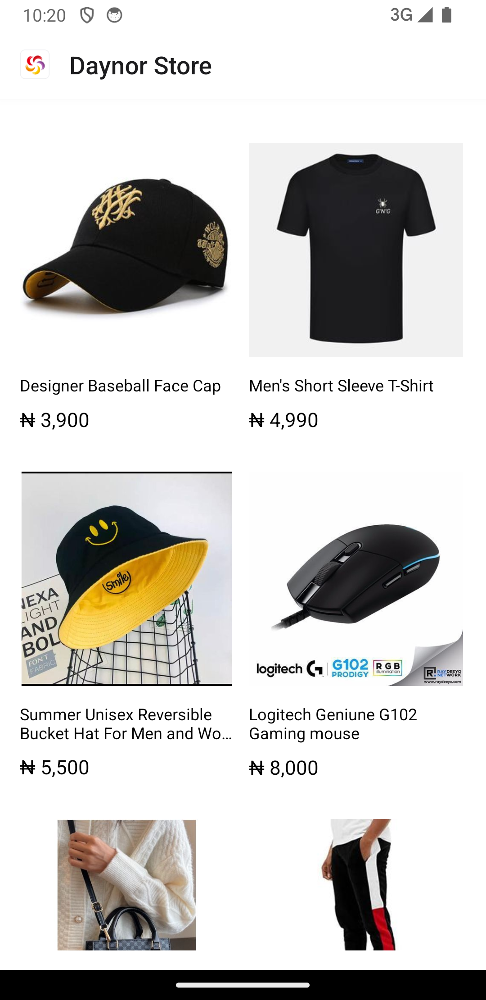

# Products Retail App

Products Retail app uses Timbu.cloud api to fetch products and show relevant information of the products added.

  // 
  // 

## Features

- fetch a list of products
- Navigate to view product details

## Demo

Try out the app on Appetize.io: [Simple Shopping App Demo](https://appetize.io)

## Getting Started

These instructions will help you set up the project on your local machine for development and testing purposes.

### Prerequisites

- Node.js (v14 or later)
- npm or yarn
- Expo CLI

### Installation

1. Clone the repository: 
   `https://github.com/Tommzydanz/shopping-app.git`
2. Navigate to the project directory: 
   `cd shopping-app`
3. Install dependencies: `npx expo install`
   or If you're using yarn: `yarn install`
4. Start the Expo development server:
   `npx expo start`
5. Use the `Expo Go app` on your mobile device to scan the QR code from the terminal or run on an emulator.

## Built With

- [React Native](https://reactnative.dev/) - The mobile application framework used
- [Expo](https://expo.dev/) - Development platform for React Native
- [TypeScript](https://www.typescriptlang.org/) - For type-safe code
- [React Navigation](https://reactnavigation.org/) - For navigation between screens

## Author

- **Tommzydanz** - *Products Retail app* - [Tommzydanz](https://github.com/Tommzydanz)

## Acknowledgments

- HNG11 [HNG internship](https://hng.tech/internship)
- Timbu api [Timbu-cloud](https://app.timbu.cloud)
- Inspiration
- etc
